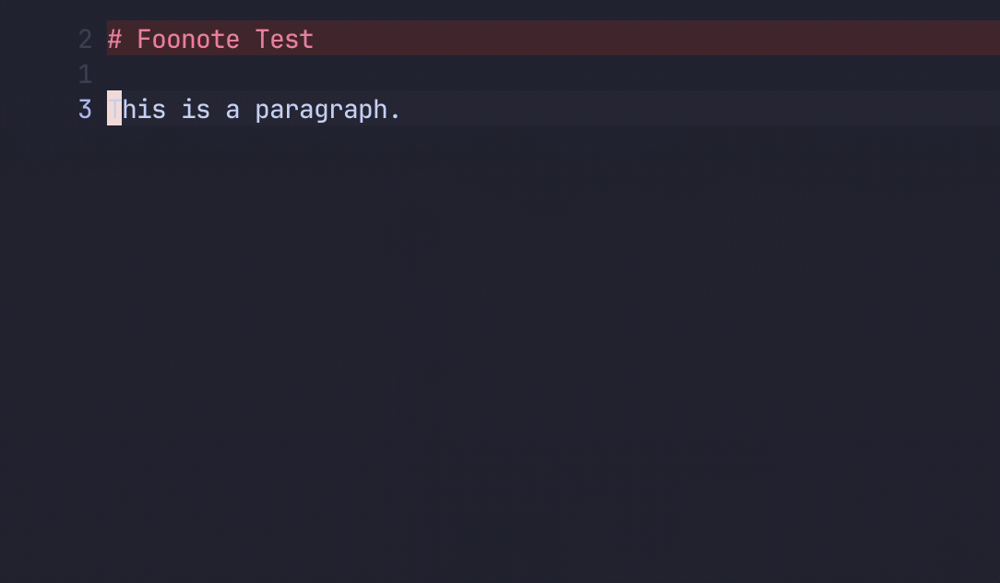
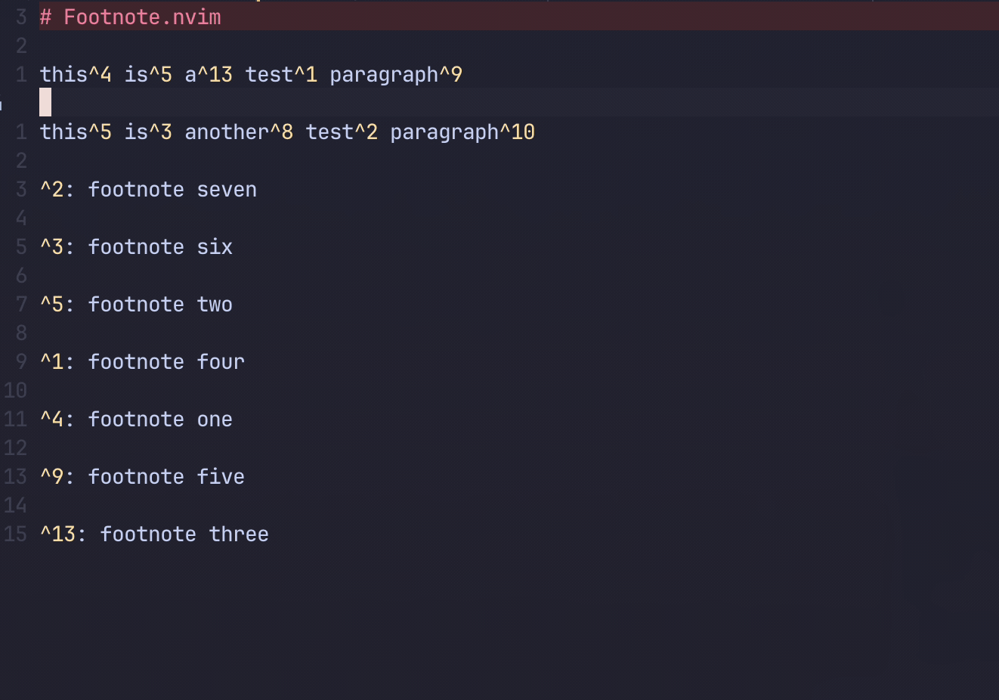
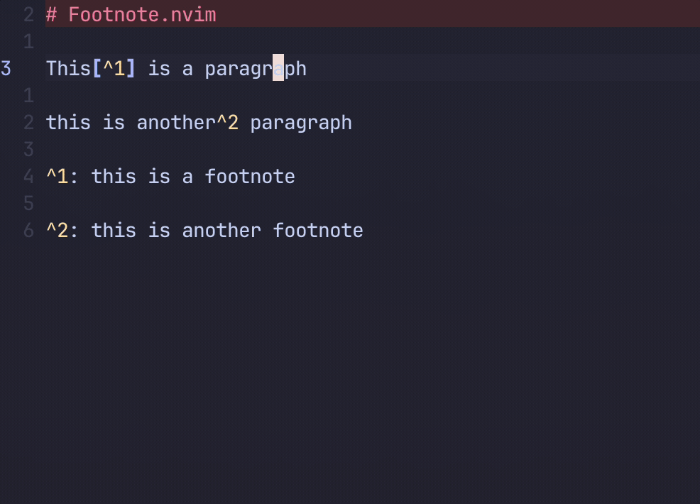
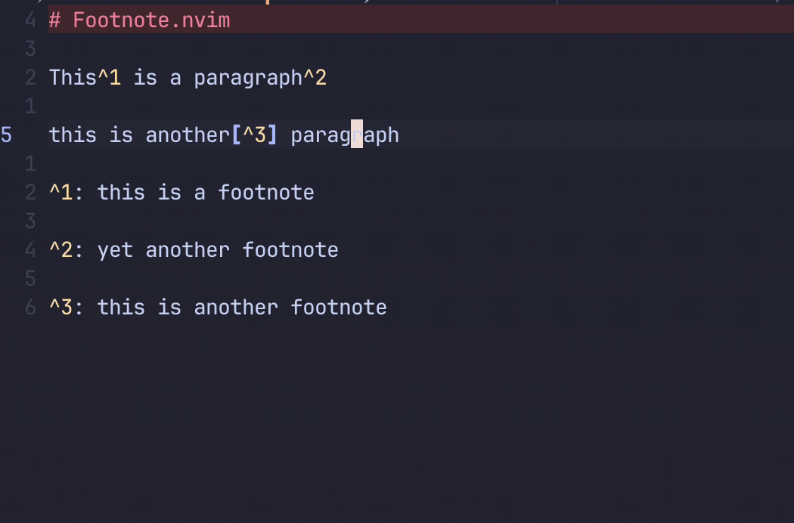

# 🏷️ Footnote.nvim

> [!WARNING]
> This plugin is still under active development. Some features aren't fully implemented yet. If you experienced unexpected errors, please open an issue.

A lightweight Neovim plugin that makes working with markdown footnote easier

## ✨ Features

- Create sequential footnotes
- Organize footnotes based on occurrence
- cleanup orphan footnotes
- Goto next/prev footnote
- Move between footnote references and its content
- Pick from existing footnotes for insertion`(WIP)`

## ⚡️ Requirements

`(WIP)`

## 📦 Installation

Install using [lazy.nvim](https://github.com/folke/lazy.nvim):

```lua
return {
  'chenxin-yan/footnote.nvim',
  config = function()
    require('footnote').setup {
      -- add any configuration here
    }
  end,
}
```

## ⚙️ Configuration

Default Configuration:

```lua
local default = {
  keys = {
    new_footnote = '<C-f>',
    organize_footnotes = '<leader>of',
    next_footnote = ']f',
    prev_footnote = '[f',
  },
  organize_on_save = true,
  organize_on_new = true,
}
```

<details><summary>Example Configuration</summary>

```lua
  return {
    'chenxin-yan/footnote.nvim',
    ft = 'markdown',
    config = function()
      require('footnote').setup {
        keys = {
          new_footnote = '<C-f>',
          organize_footnotes = '',
          next_footnote = ']f',
          prev_footnote = '[f',
        },
        organize_on_new = false,
      }
    end,
  }
```

</details>

## ⌨️ Mappings

You can disable any keymaps by setting it to `''`, and you can also manually set these keymaps.

<details><summary>Set Keymaps Manually</summary>

```lua
require('footnote').setup {
  keys = {
    new_footnote = '',
    organize_footnotes = '',
    next_footnote = '',
    prev_footnote = '',
  },
}
vim.keymap.set(
  { 'i', 'n' },
  opts.keys.new_footnote,
  "<cmd>lua require('footnote').new_footnote()<cr>",
  { buffer = 0, silent = true, desc = 'Create markdown footnote' }
)
vim.keymap.set(
  { 'n' },
  opts.keys.organize_footnotes,
  "<cmd>lua require('footnote').organize_footnotes()<cr>",
  { buffer = 0, silent = true, desc = 'Organize footnote' }
)
vim.keymap.set(
  { 'n' },
  opts.keys.next_footnote,
  "<cmd>lua require('footnote').next_footnote()<cr>",
  { buffer = 0, silent = true, desc = 'Next footnote' }
)
vim.keymap.set(
  { 'n' },
  opts.keys.prev_footnote,
  "<cmd>lua require('footnote').prev_footnote()<cr>",
  { buffer = 0, silent = true, desc = 'Previous footnote' }
)
```

</details>

## 🚀 Usage

**Create new footnote**: `require('footnote').new_footnote()` (default: `<C-f>`)

- if a footnote reference already exists at the end of the word under cursor, it would jump to that footnote



**Organize footnote**: `require('footnote').organize_footnotes()` (default: `<leader>of`)

- organize all references based on order of occurrence in the document
- footnotes are sorted based on numerical value in their references



**Organize on new footnote**: `opts = {organize_on_new = true}` (default: `true`)



**Next/Prev footnote**: `require('footnote').next_footnote()`, `require('footnote').prev_footnote()` (default: `]f`/`[f]`)



## 💡 Inspiration

- README.md inspired by [Folke](https://github.com/folke)
- [markdowny.nvim](https://github.com/antonk52/markdowny.nvim)
- [vim-markdownfootnote](https://github.com/vim-pandoc/vim-markdownfootnotes)
