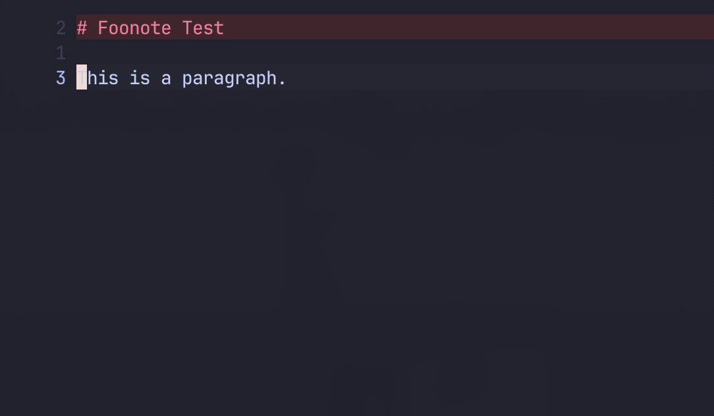
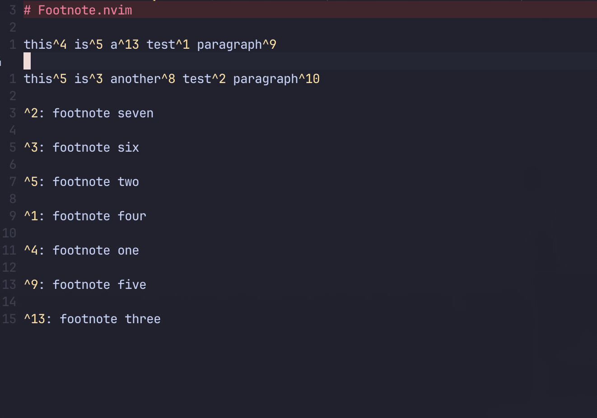
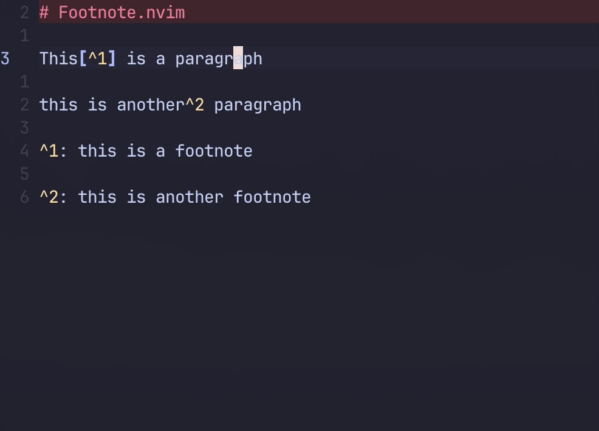
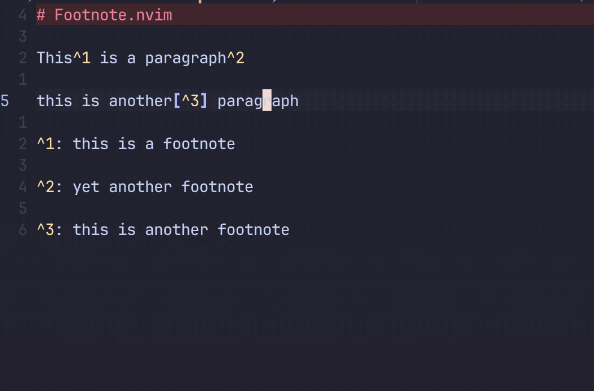

# 🏷️ Footnote.nvim

A lightweight Neovim plugin that simplifies working with Markdown footnotes

## ✨ Features

- Create sequential footnotes
- Link all occurrences of a word to the same footnote
- Organize footnotes based on occurrence
- cleanup orphan footnotes
- Goto next/prev footnote
- Move between footnote references and its content
- Pick from existing footnotes for insertion `(WIP)`

## ⚡️ Requirements

- Neovim >= 0.7.0

## 📦 Installation

Install using [lazy.nvim](https://github.com/folke/lazy.nvim):

```lua
return {
  'chenxin-yan/footnote.nvim',
  opts = {
    -- add any configuration here
  }
}
```

## ⚙️ Configuration

Default Configuration:

```lua
local default = {
  debug_print = false, -- enable debug output for renaming operations
  keys = {
    n = { -- normal mode
      new_footnote = '<leader>fn',
      organize_footnotes = '<leader>fo',
      next_footnote = ']f',
      prev_footnote = '[f',
      link_footnote = '<leader>fl',
    },
    i = { -- insert mode
      new_footnote = '<C-f>',
    },
    v = { -- visual mode
      link_footnote = '<leader>fl',
    },
  },
  organize_on_save = false, -- auto-organize footnotes on file save
  organize_on_new = false,  -- auto-organize when creating a new footnote
  case_sensitive_link = true, -- case-sensitive word matching for link_footnote
}
```

<details><summary>Example Configuration</summary>

```lua
return {
  'chenxin-yan/footnote.nvim',
  event = "VeryLazy",
  opts = {
    keys = {
      n = {
        new_footnote = '<leader>fn',
        organize_footnotes = '', -- disable organize keymap
        next_footnote = ']f',
        prev_footnote = '[f',
        link_footnote = '<leader>fl',
      },
      i = {
        new_footnote = '<C-f>',
      },
      v = {
        link_footnote = '<leader>fl',
      },
    },
    organize_on_new = true,
  }
}
```

</details>

## API Reference

| Function                                   | Description                                         |
| ------------------------------------------ | --------------------------------------------------- |
| `require('footnote').setup(opts)`          | Initialize the plugin with optional configuration   |
| `require('footnote').new_footnote()`       | Create a new footnote or jump to existing one        |
| `require('footnote').link_footnote()`      | Link all occurrences of a word to the same footnote  |
| `require('footnote').organize_footnotes()` | Organize and renumber all footnotes by occurrence    |
| `require('footnote').next_footnote()`      | Navigate to the next footnote reference              |
| `require('footnote').prev_footnote()`      | Navigate to the previous footnote reference          |

## ⌨️ Mappings

You can disable any keymap by setting it to `''`, and you can also manually set these keymaps.

<details><summary>Set Keymaps Manually</summary>

```lua
require('footnote').setup {
  keys = {
    n = {
      new_footnote = '',
      organize_footnotes = '',
      next_footnote = '',
      prev_footnote = '',
      link_footnote = '',
    },
    i = {
      new_footnote = '',
    },
    v = {
      link_footnote = '',
    },
  },
}

-- Set up keymaps for markdown files only
vim.api.nvim_create_autocmd('FileType', {
  pattern = 'markdown',
  callback = function()
    vim.keymap.set(
      'n',
      '<leader>fn',
      "<cmd>lua require('footnote').new_footnote()<cr>",
      { buffer = 0, silent = true, desc = 'Create markdown footnote' }
    )
    vim.keymap.set(
      'i',
      '<C-f>',
      "<cmd>lua require('footnote').new_footnote()<cr>",
      { buffer = 0, silent = true, desc = 'Create markdown footnote' }
    )
    vim.keymap.set(
      'n',
      '<leader>fo',
      "<cmd>lua require('footnote').organize_footnotes()<cr>",
      { buffer = 0, silent = true, desc = 'Organize footnotes' }
    )
    vim.keymap.set(
      'n',
      ']f',
      "<cmd>lua require('footnote').next_footnote()<cr>",
      { buffer = 0, silent = true, desc = 'Next footnote' }
    )
    vim.keymap.set(
      'n',
      '[f',
      "<cmd>lua require('footnote').prev_footnote()<cr>",
      { buffer = 0, silent = true, desc = 'Previous footnote' }
    )
    vim.keymap.set(
      { 'n', 'v' },
      '<leader>fl',
      ":<C-u>lua require('footnote').link_footnote()<cr>",
      { buffer = 0, silent = true, desc = 'Link all occurrences to footnote' }
    )
  end,
})
```

</details>

## 🚀 Usage

**Create new footnote**: `require('footnote').new_footnote()` (default: `<leader>fn`)

- If cursor is on/before an existing footnote reference, jumps to the corresponding definition
- If cursor is on a footnote definition, jumps to the first reference (clears orphan definitions)
- If cursor is on an orphan reference (no definition), creates a new definition
- Otherwise, creates a new sequential footnote at end of current word



**Link footnote**: `require('footnote').link_footnote()` (default: `<leader>fl`)

- Works in both normal and visual mode
- In **normal mode**, uses the word under the cursor as the search term
- In **visual mode**, uses the selected text as the search term
- If one occurrence of the word already has a footnote, all other occurrences are linked to the same reference
- If no occurrence has a footnote, a new footnote is created and all occurrences are linked to it
- Occurrences inside footnote definition lines are skipped
- Set `case_sensitive_link = false` to match words case-insensitively

**Organize footnote**: `require('footnote').organize_footnotes()` (default: `<leader>fo`)

- Organizes all references based on order of occurrence in the document
- Footnotes are sorted based on numerical value in their references
- Detects and prompts to fix footnote definitions missing colons (e.g., `[^1]` -> `[^1]:`)
- Detects orphan references (references without definitions) and prompts to delete them



**Organize on new footnote**: `opts = {organize_on_new = true}` (default: `false`)



**Next/Prev footnote**: `require('footnote').next_footnote()`, `require('footnote').prev_footnote()` (default: `]f`/`[f`)



## 💡 Inspirations

- README.md inspired by [Folke](https://github.com/folke)
- [markdowny.nvim](https://github.com/antonk52/markdowny.nvim)
- [vim-markdownfootnote](https://github.com/vim-pandoc/vim-markdownfootnotes)
